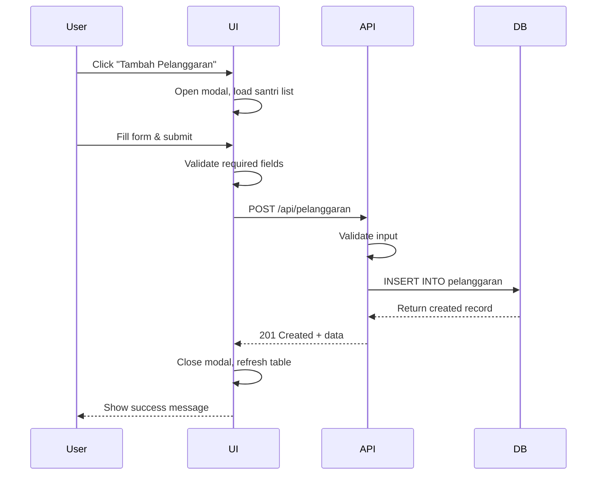
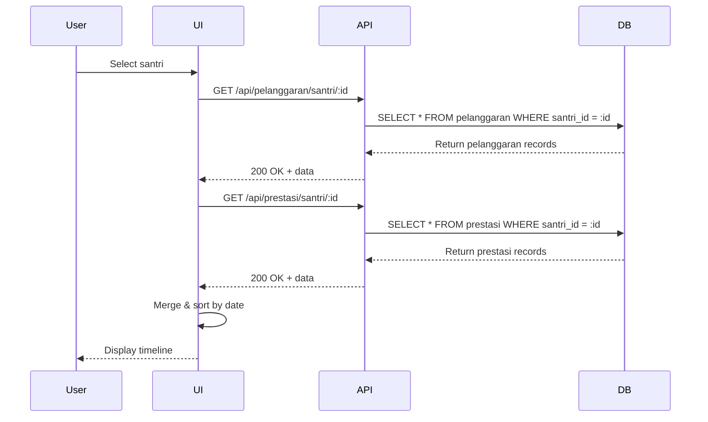

# Design Document: Pelanggaran & Prestasi

## Overview

Fitur "Pelanggaran & Prestasi" adalah modul baru dalam aplikasi SI Internal Pesantren yang memungkinkan pengelolaan catatan pelanggaran dan prestasi santri. Modul ini dirancang untuk terintegrasi dengan sistem yang sudah ada, mengikuti pola arsitektur dan desain UI yang konsisten.

### Tujuan

- Menyediakan sistem pencatatan pelanggaran santri yang terstruktur
- Menyediakan sistem pencatanan prestasi santri yang terstruktur
- Memungkinkan pengurus pesantren untuk melacak riwayat perilaku santri
- Mendukung evaluasi dan pembinaan santri berdasarkan data historis

### Scope

Modul ini mencakup:
- CRUD operations untuk data pelanggaran
- CRUD operations untuk data prestasi
- Tampilan riwayat per santri
- Integrasi dengan data santri yang sudah ada
- RESTful API endpoints
- User interface yang konsisten dengan modul existing

## Architecture

### High-Level Architecture

Aplikasi menggunakan arsitektur 3-tier yang sudah ada:

```
┌─────────────────────────────────────────────────────────────┐
│                     Presentation Layer                       │
│  ┌──────────────────────────────────────────────────────┐  │
│  │  Frontend (Vanilla JavaScript + HTML + CSS)          │  │
│  │  - Modal forms untuk input                           │  │
│  │  - Table/Card display untuk list                     │  │
│  │  - Navigation menu integration                       │  │
│  └──────────────────────────────────────────────────────┘  │
└─────────────────────────────────────────────────────────────┘
                            ↕ HTTP/JSON
┌─────────────────────────────────────────────────────────────┐
│                      Application Layer                       │
│  ┌──────────────────────────────────────────────────────┐  │
│  │  Backend API (Node.js + Express)                     │  │
│  │  - RESTful endpoints                                 │  │
│  │  - Input validation                                  │  │
│  │  - Business logic                                    │  │
│  │  - Error handling                                    │  │
│  └──────────────────────────────────────────────────────┘  │
└─────────────────────────────────────────────────────────────┘
                            ↕ SQL
┌─────────────────────────────────────────────────────────────┐
│                        Data Layer                            │
│  ┌──────────────────────────────────────────────────────┐  │
│  │  PostgreSQL Database                                 │  │
│  │  - pelanggaran table                                 │  │
│  │  - prestasi table                                    │  │
│  │  - Foreign key constraints ke santri table          │  │
│  └──────────────────────────────────────────────────────┘  │
└─────────────────────────────────────────────────────────────┘
```

### Integration Points

Modul ini terintegrasi dengan sistem yang sudah ada melalui:

1. **Database Integration**: Foreign key relationship dengan tabel `santri`
2. **API Integration**: Menggunakan pola endpoint yang sama dengan modul existing
3. **UI Integration**: Menambahkan menu item baru di sidebar navigation
4. **Data Integration**: Menggunakan data santri untuk dropdown selection

## Components and Interfaces

### Backend Components

#### 1. Pelanggaran API Endpoints

**GET /api/pelanggaran**
- Mengambil semua data pelanggaran
- Response: Array of pelanggaran objects dengan join ke santri

**POST /api/pelanggaran**
- Membuat record pelanggaran baru
- Request body: `{ santri_id, jenis, tanggal, deskripsi, sanksi }`
- Validation: Required fields check
- Response: Created pelanggaran object

**PUT /api/pelanggaran/:id**
- Update record pelanggaran existing
- Request body: `{ santri_id, jenis, tanggal, deskripsi, sanksi }`
- Validation: Required fields check, record existence
- Response: Updated pelanggaran object

**DELETE /api/pelanggaran/:id**
- Hapus record pelanggaran
- Validation: Record existence
- Response: Success message

**GET /api/pelanggaran/santri/:santriId**
- Mengambil semua pelanggaran untuk santri tertentu
- Response: Array of pelanggaran objects untuk santri tersebut

#### 2. Prestasi API Endpoints

**GET /api/prestasi**
- Mengambil semua data prestasi
- Response: Array of prestasi objects dengan join ke santri

**POST /api/prestasi**
- Membuat record prestasi baru
- Request body: `{ santri_id, jenis, tanggal, deskripsi, penghargaan }`
- Validation: Required fields check
- Response: Created prestasi object

**PUT /api/prestasi/:id**
- Update record prestasi existing
- Request body: `{ santri_id, jenis, tanggal, deskripsi, penghargaan }`
- Validation: Required fields check, record existence
- Response: Updated prestasi object

**DELETE /api/prestasi/:id**
- Hapus record prestasi
- Validation: Record existence
- Response: Success message

**GET /api/prestasi/santri/:santriId**
- Mengambil semua prestasi untuk santri tertentu
- Response: Array of prestasi objects untuk santri tersebut

### Frontend Components

#### 1. Navigation Menu
- Menambahkan menu item "Pelanggaran & Prestasi" di sidebar
- Menggunakan pola yang sama dengan menu existing
- Active state highlighting

#### 2. Main Panel
- Container untuk menampilkan tab pelanggaran dan prestasi
- Tab switching mechanism
- Action buttons (Tambah Pelanggaran, Tambah Prestasi)

#### 3. Pelanggaran Tab
- Table display untuk list pelanggaran
- Columns: NIS, Nama Santri, Jenis, Tanggal, Deskripsi, Sanksi, Aksi
- Sort functionality
- Edit dan Delete buttons per row

#### 4. Prestasi Tab
- Table display untuk list prestasi
- Columns: NIS, Nama Santri, Jenis, Tanggal, Deskripsi, Penghargaan, Aksi
- Sort functionality
- Edit dan Delete buttons per row

#### 5. Pelanggaran Form Modal
- Modal dialog untuk add/edit pelanggaran
- Fields:
  - Santri (dropdown dengan search)
  - Jenis Pelanggaran (text input)
  - Tanggal (date picker)
  - Deskripsi (textarea)
  - Sanksi (textarea)
- Validation messages
- Submit dan Cancel buttons

#### 6. Prestasi Form Modal
- Modal dialog untuk add/edit prestasi
- Fields:
  - Santri (dropdown dengan search)
  - Jenis Prestasi (text input)
  - Tanggal (date picker)
  - Deskripsi (textarea)
  - Penghargaan (text input)
- Validation messages
- Submit dan Cancel buttons

#### 7. Riwayat Santri View
- Dapat diakses dari detail santri atau sebagai filter
- Menampilkan timeline pelanggaran dan prestasi
- Summary statistics (total pelanggaran, total prestasi)
- Chronological order (newest first)

## Data Models

### Database Schema

#### Table: pelanggaran

```sql
CREATE TABLE IF NOT EXISTS pelanggaran (
  id SERIAL PRIMARY KEY,
  santri_id INTEGER NOT NULL REFERENCES santri(id) ON DELETE RESTRICT,
  jenis VARCHAR(150) NOT NULL,
  tanggal DATE NOT NULL,
  deskripsi TEXT,
  sanksi TEXT,
  created_at TIMESTAMPTZ DEFAULT NOW()
);

CREATE INDEX idx_pelanggaran_santri_id ON pelanggaran(santri_id);
CREATE INDEX idx_pelanggaran_tanggal ON pelanggaran(tanggal DESC);
```

**Columns:**
- `id`: Primary key, auto-increment
- `santri_id`: Foreign key ke tabel santri, NOT NULL, ON DELETE RESTRICT
- `jenis`: Jenis pelanggaran (e.g., "Terlambat", "Tidak Mengikuti Sholat Berjamaah"), VARCHAR(150), NOT NULL
- `tanggal`: Tanggal kejadian pelanggaran, DATE, NOT NULL
- `deskripsi`: Deskripsi detail pelanggaran, TEXT, nullable
- `sanksi`: Sanksi yang diberikan, TEXT, nullable
- `created_at`: Timestamp pembuatan record, TIMESTAMPTZ, default NOW()

**Constraints:**
- Primary key pada `id`
- Foreign key `santri_id` REFERENCES `santri(id)` ON DELETE RESTRICT
- NOT NULL pada `santri_id`, `jenis`, `tanggal`

**Indexes:**
- Index pada `santri_id` untuk query per santri
- Index pada `tanggal` DESC untuk sorting chronological

#### Table: prestasi

```sql
CREATE TABLE IF NOT EXISTS prestasi (
  id SERIAL PRIMARY KEY,
  santri_id INTEGER NOT NULL REFERENCES santri(id) ON DELETE RESTRICT,
  jenis VARCHAR(150) NOT NULL,
  tanggal DATE NOT NULL,
  deskripsi TEXT,
  penghargaan VARCHAR(200),
  created_at TIMESTAMPTZ DEFAULT NOW()
);

CREATE INDEX idx_prestasi_santri_id ON prestasi(santri_id);
CREATE INDEX idx_prestasi_tanggal ON prestasi(tanggal DESC);
```

**Columns:**
- `id`: Primary key, auto-increment
- `santri_id`: Foreign key ke tabel santri, NOT NULL, ON DELETE RESTRICT
- `jenis`: Jenis prestasi (e.g., "Juara Lomba Tahfidz", "Prestasi Akademik"), VARCHAR(150), NOT NULL
- `tanggal`: Tanggal pencapaian prestasi, DATE, NOT NULL
- `deskripsi`: Deskripsi detail prestasi, TEXT, nullable
- `penghargaan`: Penghargaan yang diterima, VARCHAR(200), nullable
- `created_at`: Timestamp pembuatan record, TIMESTAMPTZ, default NOW()

**Constraints:**
- Primary key pada `id`
- Foreign key `santri_id` REFERENCES `santri(id)` ON DELETE RESTRICT
- NOT NULL pada `santri_id`, `jenis`, `tanggal`

**Indexes:**
- Index pada `santri_id` untuk query per santri
- Index pada `tanggal` DESC untuk sorting chronological

### Data Flow

#### Create Pelanggaran Flow



#### View Riwayat Santri Flow



## Error Handling

### Backend Error Handling

#### Validation Errors (400 Bad Request)
- Missing required fields (santri_id, jenis, tanggal)
- Invalid data types
- Invalid foreign key references

**Response format:**
```json
{
  "error": "Santri, jenis pelanggaran, dan tanggal wajib diisi."
}
```

#### Not Found Errors (404 Not Found)
- Record tidak ditemukan saat update/delete
- Santri tidak ditemukan

**Response format:**
```json
{
  "error": "Data pelanggaran tidak ditemukan."
}
```

#### Foreign Key Constraint Errors (400 Bad Request)
- Attempt to delete santri yang memiliki pelanggaran/prestasi

**Response format:**
```json
{
  "error": "Santri tidak dapat dihapus karena memiliki catatan pelanggaran atau prestasi."
}
```

#### Server Errors (500 Internal Server Error)
- Database connection errors
- Unexpected errors

**Response format:**
```json
{
  "error": "Gagal memproses permintaan. Silakan coba lagi."
}
```

### Frontend Error Handling

#### Form Validation
- Client-side validation sebelum submit
- Display inline error messages untuk required fields
- Prevent form submission jika ada validation errors

#### API Error Handling
- Display error messages dari API response
- Show user-friendly messages untuk network errors
- Retry mechanism untuk transient errors

#### User Feedback
- Success messages setelah operasi berhasil
- Error messages yang jelas dan actionable
- Loading states selama API calls

## Testing Strategy

### Unit Tests

Unit tests akan fokus pada:

1. **API Endpoint Tests**
   - Test setiap endpoint dengan valid input
   - Test dengan missing required fields
   - Test dengan invalid data types
   - Test dengan non-existent IDs
   - Test foreign key constraints

2. **Input Validation Tests**
   - Test normalizeText function
   - Test date validation
   - Test required field validation

3. **Database Query Tests**
   - Test INSERT operations
   - Test UPDATE operations
   - Test DELETE operations
   - Test SELECT with JOIN operations
   - Test foreign key constraint enforcement

4. **Frontend Component Tests**
   - Test modal open/close behavior
   - Test form submission
   - Test table rendering
   - Test tab switching
   - Test santri dropdown population

### Integration Tests

Integration tests akan mencakup:

1. **End-to-End CRUD Operations**
   - Create pelanggaran → verify in database → retrieve via API
   - Update pelanggaran → verify changes persisted
   - Delete pelanggaran → verify removal
   - Same for prestasi

2. **Santri Integration**
   - Create pelanggaran for existing santri
   - Attempt to delete santri with pelanggaran (should fail)
   - Verify santri data appears correctly in pelanggaran list

3. **UI Integration**
   - Navigate to Pelanggaran & Prestasi panel
   - Create record via UI → verify in database
   - Edit record via UI → verify changes
   - Delete record via UI → verify removal

### Manual Testing Checklist

- [ ] Menu navigation berfungsi dengan benar
- [ ] Tab switching antara Pelanggaran dan Prestasi
- [ ] Modal form dapat dibuka dan ditutup
- [ ] Dropdown santri menampilkan data dengan benar
- [ ] Form validation menampilkan error messages
- [ ] Create operation berhasil dan data muncul di table
- [ ] Edit operation berhasil dan perubahan tersimpan
- [ ] Delete operation berhasil dan data terhapus
- [ ] Riwayat per santri menampilkan data dengan benar
- [ ] Responsive design di mobile dan desktop
- [ ] Konsistensi styling dengan modul existing

## Implementation Notes

### Backend Implementation

1. **Add routes to server.js**
   - Tambahkan endpoint handlers setelah existing routes
   - Gunakan pola yang sama dengan modul existing (santri, guru, kelas)
   - Implement normalizeText untuk input sanitization

2. **Update sql/init.sql**
   - Tambahkan CREATE TABLE statements untuk pelanggaran dan prestasi
   - Tambahkan indexes untuk performance
   - Ensure foreign key constraints

3. **Error handling**
   - Gunakan try-catch blocks
   - Check for specific error codes (23503 untuk foreign key, 23505 untuk unique)
   - Return appropriate HTTP status codes

### Frontend Implementation

1. **Update public/index.html**
   - Tambahkan menu item di sidebar
   - Tambahkan panel section untuk Pelanggaran & Prestasi
   - Tambahkan modal structures untuk forms
   - Gunakan tab pattern untuk switching antara Pelanggaran dan Prestasi

2. **Update public/script.js**
   - Tambahkan event listeners untuk menu navigation
   - Implement modal open/close functions
   - Implement CRUD operations dengan fetch API
   - Implement table rendering functions
   - Implement form validation
   - Implement tab switching logic

3. **Update public/styles.css**
   - Reuse existing styles untuk consistency
   - Add specific styles jika diperlukan untuk layout baru

### Database Migration

Untuk existing installations, tambahkan migration script:

```sql
-- Migration: Add pelanggaran and prestasi tables
-- Run this after existing tables are created

CREATE TABLE IF NOT EXISTS pelanggaran (
  id SERIAL PRIMARY KEY,
  santri_id INTEGER NOT NULL REFERENCES santri(id) ON DELETE RESTRICT,
  jenis VARCHAR(150) NOT NULL,
  tanggal DATE NOT NULL,
  deskripsi TEXT,
  sanksi TEXT,
  created_at TIMESTAMPTZ DEFAULT NOW()
);

CREATE INDEX idx_pelanggaran_santri_id ON pelanggaran(santri_id);
CREATE INDEX idx_pelanggaran_tanggal ON pelanggaran(tanggal DESC);

CREATE TABLE IF NOT EXISTS prestasi (
  id SERIAL PRIMARY KEY,
  santri_id INTEGER NOT NULL REFERENCES santri(id) ON DELETE RESTRICT,
  jenis VARCHAR(150) NOT NULL,
  tanggal DATE NOT NULL,
  deskripsi TEXT,
  penghargaan VARCHAR(200),
  created_at TIMESTAMPTZ DEFAULT NOW()
);

CREATE INDEX idx_prestasi_santri_id ON prestasi(santri_id);
CREATE INDEX idx_prestasi_tanggal ON prestasi(tanggal DESC);
```

### API Response Examples

**GET /api/pelanggaran response:**
```json
[
  {
    "id": 1,
    "santri_id": 5,
    "nis": "2024001",
    "nama_santri": "Ahmad Fauzi",
    "jenis": "Terlambat Sholat Berjamaah",
    "tanggal": "2024-01-15",
    "deskripsi": "Terlambat sholat subuh berjamaah tanpa keterangan",
    "sanksi": "Membersihkan masjid selama 3 hari",
    "created_at": "2024-01-15T08:30:00Z"
  }
]
```

**POST /api/pelanggaran request:**
```json
{
  "santri_id": 5,
  "jenis": "Terlambat Sholat Berjamaah",
  "tanggal": "2024-01-15",
  "deskripsi": "Terlambat sholat subuh berjamaah tanpa keterangan",
  "sanksi": "Membersihkan masjid selama 3 hari"
}
```

**GET /api/prestasi response:**
```json
[
  {
    "id": 1,
    "santri_id": 3,
    "nis": "2024002",
    "nama_santri": "Fatimah Zahra",
    "jenis": "Juara Lomba Tahfidz",
    "tanggal": "2024-01-20",
    "deskripsi": "Juara 1 Lomba Tahfidz Juz 30 tingkat kabupaten",
    "penghargaan": "Piala dan Sertifikat",
    "created_at": "2024-01-20T14:00:00Z"
  }
]
```

## Security Considerations

1. **Input Sanitization**
   - Gunakan normalizeText untuk semua text inputs
   - Prevent SQL injection dengan parameterized queries
   - Escape HTML dalam output untuk prevent XSS

2. **Authorization**
   - Saat ini aplikasi tidak memiliki authentication layer
   - Future enhancement: Add role-based access control
   - Consider read-only access untuk certain users

3. **Data Validation**
   - Validate di client-side dan server-side
   - Enforce foreign key constraints di database level
   - Validate date formats dan ranges

4. **Error Messages**
   - Jangan expose internal error details ke user
   - Log detailed errors di server untuk debugging
   - Return user-friendly messages

## Performance Considerations

1. **Database Indexes**
   - Index pada santri_id untuk fast lookups
   - Index pada tanggal untuk sorting
   - Consider composite index jika query patterns menunjukkan kebutuhan

2. **Query Optimization**
   - Use JOIN untuk menghindari N+1 queries
   - Limit result sets jika data volume besar
   - Consider pagination untuk large datasets

3. **Frontend Performance**
   - Lazy load santri dropdown data
   - Debounce search inputs
   - Cache santri list untuk reuse

4. **Caching Strategy**
   - Consider caching santri list di frontend
   - Invalidate cache saat data santri berubah
   - Use browser localStorage untuk temporary cache

## Future Enhancements

1. **Filtering dan Search**
   - Filter by date range
   - Search by santri name or NIS
   - Filter by jenis pelanggaran/prestasi

2. **Reporting**
   - Generate reports per periode
   - Export to PDF/Excel
   - Statistics dashboard (most common violations, top achievers)

3. **Notifications**
   - Email notifications untuk pelanggaran serius
   - SMS notifications ke orang tua
   - Dashboard alerts untuk pengurus

4. **Bulk Operations**
   - Bulk import dari Excel
   - Bulk delete dengan filters
   - Bulk edit untuk sanksi yang sama

5. **Advanced Features**
   - Point system untuk pelanggaran dan prestasi
   - Automatic sanctions based on violation type
   - Integration dengan sistem akademik
   - Mobile app untuk akses cepat

## Deployment Checklist

- [ ] Update sql/init.sql dengan table definitions
- [ ] Run database migration
- [ ] Deploy backend changes (server.js)
- [ ] Deploy frontend changes (HTML, CSS, JS)
- [ ] Test all CRUD operations
- [ ] Verify foreign key constraints
- [ ] Test UI responsiveness
- [ ] Verify error handling
- [ ] Update documentation
- [ ] Train users on new feature
